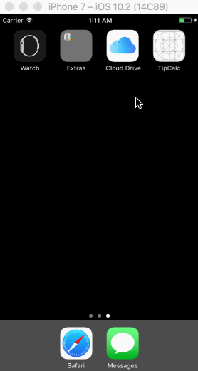

<h1>TipCalculator</h1>
<pre>
This is a Tip Calculator application for iOS submitted as the pre-assignment requirement for Codepath.

Time spent: 4 hours

Tasks Completed:

 Required: User can enter a bill amount, choose a tip percentage, and see the tip and total values.
 Required: Settings page to change the default tip percentage.
 Optional: UI animations
 Optional: Remembering the bill amount across app restarts
 Additional: Bill amount is always the first responder avoiding the need to tap for entering the bill amount.
 Additional: Remembering the tip percentage across app restarts.
 Additional: The amount to be paid per person.
 Additional: Number of people can be set from the seetings screen.
 
 Demo:</pre>
 
 
